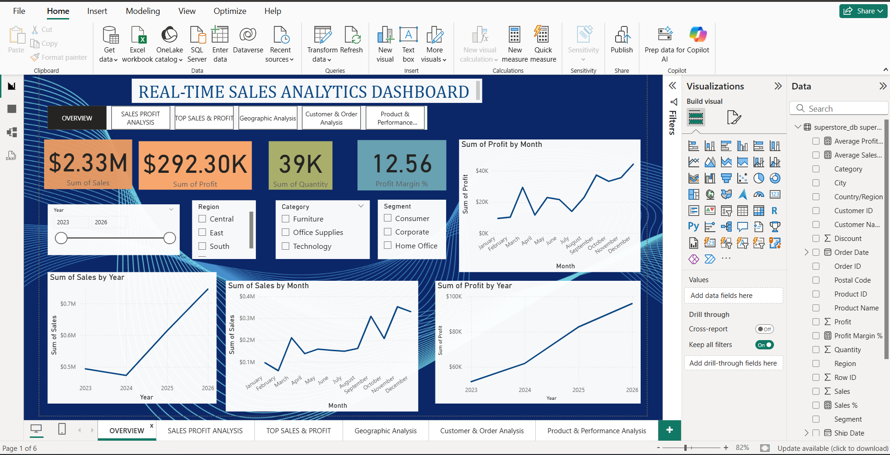

# Real-Time Sales Analytics Dashboard

## 📊 Project Overview

The **Real-Time Sales Analytics Dashboard** is a business intelligence project built to analyze sales, profit, customers, products, orders, and regional performance.

The project uses **Python, SQL, MySQL, and Power BI** to transform raw Superstore sales data into meaningful business insights through interactive dashboards and visualizations.

## 🎯 Objectives

* Analyze overall sales and profit performance
* Identify top-performing products and customers
* Analyze sales and profit by category and segment
* Study geographical sales performance
* Analyze customer and order trends
* Identify loss-making products
* Understand monthly and yearly sales trends
* Build an interactive Power BI dashboard for business analysis

## 🛠️ Technologies Used

* **Python** – Data analysis and preprocessing
* **Pandas** – Data manipulation
* **Matplotlib** – Data visualization
* **MySQL** – Data storage and SQL analysis
* **SQL** – Data querying and business analysis
* **Power BI** – Interactive dashboard and visualization
* **Jupyter Notebook** – Python-based analysis
* **GitHub** – Project version control and portfolio

## 📁 Project Files

| File                                         | Description                      |
| -------------------------------------------- | -------------------------------- |
| `Real-Time Sales Analytics Dashboard.pbix`   | Power BI dashboard               |
| `Real-Time Sales Analytics.IPYNB.ipynb`      | Python/Jupyter Notebook          |
| `real time sales analysis dashboard.SQL.sql` | SQL queries and analysis         |
| `superstore.csv`                             | Source dataset                   |
| `S1_OVERVIEW.png`                            | Dashboard overview               |
| `S2 SALES PROFIT ANALYSIS.png`               | Sales and profit analysis        |
| `S3_TOP SALES & PROFIT.png`                  | Top sales and profit analysis    |
| `S4_GEOGRAPHIC ANALYSIS.png`                 | Geographic analysis              |
| `S5_CUSTOMER & ORDER ANALYSIS.png`           | Customer and order analysis      |
| `S6_PRODUCT & PERFORMANCE ANALYSIS.png`      | Product and performance analysis |

## 📈 Dashboard Sections

### 1. Overview

Provides a high-level view of important sales and profit metrics.

### 2. Sales & Profit Analysis

Analyzes sales and profit across different time periods, categories, segments, and shipping modes.

### 3. Top Sales & Profit

Highlights top-performing products and customers based on sales and profit.

### 4. Geographic Analysis

Analyzes sales and profit across different regions, states, and locations.

### 5. Customer & Order Analysis

Provides insights into customers, orders, and purchasing patterns.

### 6. Product & Performance Analysis

Analyzes product-level performance and identifies profitable and loss-making products.

## 🔍 Key Analysis Performed

* Sales by year
* Profit by year
* Sales by month
* Profit by month
* Sales by category
* Profit by category
* Sales by segment
* Profit by segment
* Sales by shipping mode
* Profit by shipping mode
* Top 10 products by sales
* Top 10 products by profit
* Top 10 customers by sales
* Top 10 customers by profit
* Top 10 loss-making products
* Geographic sales analysis

## 🔄 Project Workflow

```text
Superstore Dataset
       ↓
Python Data Cleaning & Analysis
       ↓
MySQL Database
       ↓
SQL Queries & Business Analysis
       ↓
Power BI Data Connection
       ↓
Interactive Sales Analytics Dashboard
```

## 📊 Dashboard Preview

### Overview



### Sales & Profit Analysis


### Top Sales & Profit


### Geographic Analysis


### Customer & Order Analysis


### Product & Performance Analysis


## 🚀 How to Use

1. Download the `superstore.csv` dataset.
2. Open the Jupyter Notebook to view the Python analysis.
3. Open the SQL file to view the MySQL queries.
4. Open the `.pbix` file using Microsoft Power BI Desktop.
5. Explore the interactive dashboard pages.

## 👨‍💻 Project Purpose

This project was developed as a **data analytics and business intelligence portfolio project** to demonstrate practical skills in Python, SQL, MySQL, Power BI, data analysis, and dashboard development.

## 📌 Future Improvements

* Add automated data refresh
* Add real-time or scheduled data updates
* Add additional business KPIs
* Add advanced customer segmentation
* Deploy the dashboard using Power BI Service

---

**Tools:** Python | Pandas | MySQL | SQL | Power BI | Jupyter Notebook
